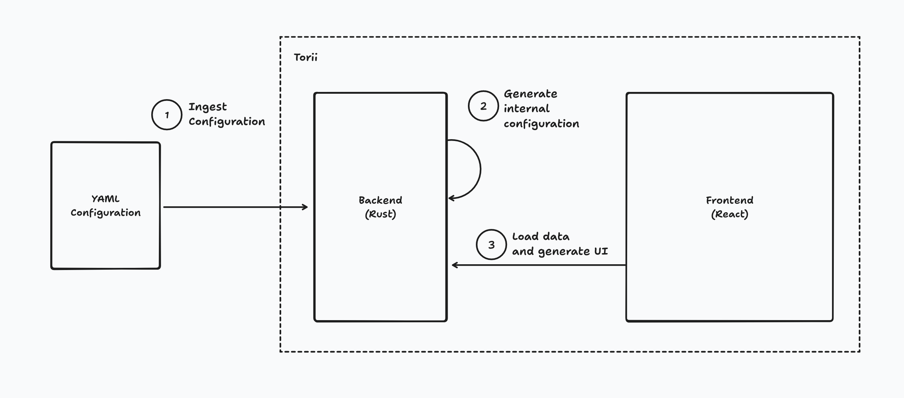
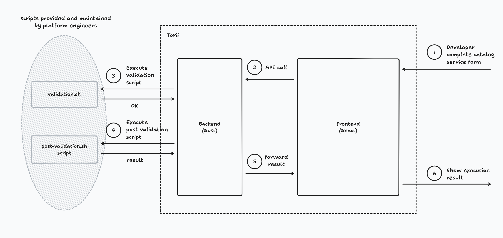

# Torii ⛩️

Torii is a simple, powerful and extensible open-source Internal Developer Portal where developers can find all the tools and
services they need to build, deploy, and manage their applications.

Torii focus on three principles:

- **Easily configurable**: Platform Engineers can easily define a catalog of tools and services available to developers. They can also
  define a scorecard and a workflow for each tool and service.
- **Easily usable**: Developers can easily find and use the tools and services they need to build, deploy, and manage their applications via
  a simple web interface.
- **Easily extensible**: Platform Engineers can easily extend Torii by adding new tools and services to the catalog.

That's it!

> ⚠️ Torii is in active development and not ready for production yet.

## Getting Started

### Prerequisites

- MacOSX / Linux / Windows
- Postgres

### Installation

Today you can run Torii using Docker Compose. In the future, we will provide a Helm chart to deploy Torii on Kubernetes and even locally.

```bash
docker compose up
```

## Usage

Once Torii is started, you can access the frontend at `http://localhost:5173`. The backend is available at `http://localhost:9999`.

## Configuration

### Configuration file

```yaml
catalog:
  - name: string
    description: string (optional)
    icon: url (optional)
    fields:
      - title: string
        description: string (optional)
        placeholder: string (optional)
        type: string|integer|float|boolean|list
        default: string (optional)
        required: boolean
        autocomplete-fetcher: ./your-script.py (optional)
    validation:
      - validation-script-1.sh # executed first
      - validation-script-2.sh # AND then this one
    post-validation:
      - script: post-validation-script-1.sh # executed first
        model: string (optional) # model name
      - script: post-validation-script-2.sh # AND then this one
        model: string (optional) # model name
      - script: post-validation-script-3.sh # AND finally this one
        model: string (optional) # model name
models:
  - name: string
    description: string (optional)
    fields:
      - title: string
        type: string|integer|float|boolean|list
        default: string (optional)
        required: boolean
```

### Autocomplete Fetcher

An autocomplete fetcher is a script that must print a JSON on standard output. The JSON must contain a `results` key that contains a list of
values.

```json
{
  "results": [
    "val 1",
    "val 2",
    "val 3"
  ]
}
```

Example of autocomplete fetcher in python:

```python
import json


def get_data_from_fake_api():
    return [
        'val 1',
        'val 2',
        'val 3',
    ]


if __name__ == '__main__':
    # do your stuff here
    results = get_data_from_fake_api()

    data = {'results': results}

    # print json on standard output
    print(json.dumps(data))
```

### Validation Script

An validation script can be any kind of script. It can be a bash script, a python script, a terraform script, etc. The script must exit with
a non-zero exit code if the validation fails.

```bash
#!/bin/bash

set -e # exit on error
# print error on standard error output

# do your stuff here
exit 0
```

### Post Validation Script

An post validation script can be any kind of script. It can be a bash script, a python script, a terraform script, etc.

- The script must exit with a non-zero exit code if the validation fails.
- The script must be idempotent. It can be executed multiple times without side effects.
- The output of the script must be a JSON that contains the defined model keys with their values. (Torii will update the model with
  the values returned by the script)

```json
{
  "status": "success",
  "url": "https://my-service.com",
  "username": "my-username",
  "password": "my-password"
}
```

```bash
#!/bin/bash

set -e # exit on error
# print error on standard error output

# do your stuff here
exit 0
```

## Features

| Feature          | Status              |
|------------------|---------------------|
| Catalogs Service | WIP                 |
| Authentication   | Not implemented yet |
| Authorization    | Not implemented yet |
| Audit            | Not implemented yet |

### Catalogs Service

The Catalogs Service is the core of Torii. It allows Platform Engineers to define a catalog of tools and services that developers can
use to build, deploy, and manage their applications.

The Catalogs Service is a simple YAML file that contains the list of tools and services available to developers. It also contains the list
of scripts to run to validate and submit the form.

## How Torii works

Torii works with 2 main components:

- Backend: The backend is a Rust application that exposes a REST API to interact with the frontend. It's configured with a YAML file that
  contains the catalog of tools and services available to developers.
- Frontend: The frontend is a React application that interacts with the backend to display the catalog of tools and services available to
  developers.



Once the backend is started, it loads the configuration file, checks the syntax, and starts the REST API. Then, the frontend can be started
and it will interact with the backend to display the catalog of tools and services available to developers.

When a developer wants to use a tool or service, the frontend sends a request to the backend to get the form to fill. The backend sends the
form to the frontend, the developer fills it, and sends it back to the backend. The backend runs the validation scripts, the post-validation
scripts, and updates the model with the values returned by the post-validation scripts.



As a Platform Engineer, you can easily define a catalog of tools and services available to developers.

## Contributing

Torii is still in early development. If you want to contribute, please open an issue or a pull request. We will improve the
contribution guidelines as soon as possible.

## Motivation

Today you have the choice between three options to build your Internal Developer Portal:

1. Use [Backstage](https://backstage.io) from Spotify. It's a great solution but it's hard to extend and customize. You need to be a
   TypeScript/React expert to extend it.
2. Use a proprietary SaaS solution like Port, Cortex, OpsLevel, etc. It's a great solution but it's expensive and you don't have control
   over the codebase.
3. Build your own solution from scratch. It's a great solution but it's hard to maintain and scale. You need to be a full-stack developer to
   build it.

Torii is a simple, powerful, and extensible open-source Internal Developer Portal that aims to be the best of all worlds. It's easy to
extend and customize, it's free, and you have control over the codebase.

## FAQ

### What's the difference between Torii and Qovery?

The Qovery and Torii projects are two different projects with different goals:

- [Qovery](https://www.qovery.com) is an Internal Developer **Platform** focusing on the Software Development Lifecycle (build, deploy, run).
- Torii is an Internal Developer **Portal** focusing on unifying the experience of all engineering tools.

Here is a features table to help you understand the difference:

| Feature               | Qovery (Internal Developer Platform) | Torii (Internal Developer Portal) |
|-----------------------|--------------------------------------|-----------------------------------|
| Build                 | ✅                                    | ❌                                 |
| Deploy                | ✅                                    | ❌                                 |
| Run                   | ✅                                    | ❌                                 |
| Ephemeral Environment | ✅                                    | ❌                                 |
| Self-Service          | ✅                                    | ✅                                 |
| Catalogs Service      | ❌                                    | ✅                                 |
| Scorecard Service     | ❌                                    | ✅                                 |
| Workflow Service      | Partial with the concept of Pipeline | ✅                                 |

### Why Torii?

Torii is a [Japanese gate](https://en.wikipedia.org/wiki/Torii) most commonly found at the entrance of or within a Shinto shrine, where it symbolically marks the transition from the mundane to the sacred.
